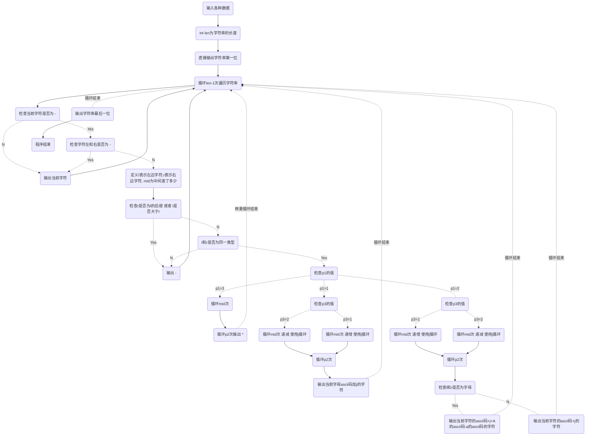

# # 字符串的展开(expand.cpp)

题目链接：<a href="https://www.luogu.com.cn/problem/P1098" class="LinkCard">luogu</a>

## 题目描述

> 在初赛普及组的“阅读程序写结果”的问题中，我们曾给出一个字符串展开的例子：如果在输入的字符串中，含有类似于“d-h”或者“4-8”的字串，我们就把它当作一种简写，输出时，用连续递增的字母或数字串替代其中的减号，即，将上面两个子串分别输出为“defgh”和“45678”。在本题中，我们通过增加一些参数的设置，使字符串的展开更为灵活。具体约定如下：

> (1)遇到下面的情况需要做字符串的展开：在输入的字符串中，出现了减号“-”，减号两侧同为小写字母或同为数字，且按照ASCII码的顺序，减号右边的字符严格大于左边的字符。

> (2)参数p1：展开方式。p1=1时，对于字母子串，填充小写字母；p1=2时，对于字母子串，填充大写字母。这两种情况下数字子串的填充方式相同。p1=3时，不论是字母子串还是数字字串，都用与要填充的字母个数相同的星号“*”来填充。

> (3)参数p2：填充字符的重复个数。p2=k表示同一个字符要连续填充k个。例如，当p2=3时，子串“d-h”应扩展为“deeefffgggh”。减号两边的字符不变。

> (4)参数p3：是否改为逆序：p3=1表示维持原来顺序，p3=2表示采用逆序输出，注意这时候仍然不包括减号两端的字符。例如当p1=1、p2=2、p3=2时，子串“d-h”应扩展为“dggffeeh”。

> (5)如果减号右边的字符恰好是左边字符的后继，只删除中间的减号，例如：“d-e”应输出为“de”，“3-4”应输出为“34”。如果减号右边的字符按照ASCII码的顺序小于或等于左边字符，输出时，要保留中间的减号，例如：“d-d”应输出为“d-d”，“3-1”应输出为“3-1”。

### 输入格式

> 输入文件expand.in包括两行：

> 第1行为用空格隔开的3个正整数，一次表示参数p1，p2，p3。

> 第2行为一行字符串，仅由数字、小写字母和减号“-”组成。行首和行末均无空格。

### 输出格式

> 输出文件expand.out只有一行，为展开后的字符串。

#### 样例1输入

```markdown
1 2 1
abcs-w1234-9s-4zz
```

#### 样例1输出

```markdown
abcsttuuvvw1234556677889s-4zz
```

#### 样例2输入

```markdown
2 3 2
a-d-d
```

#### 样例2输出

```markdown
aCCCBBBd-d
```

#### 样例3输入

```markdown
3 4 2
di-jkstra2-6
```

#### 样例3输出

```markdown
dijkstra2************6
```

## 大致思路

这里我们可以发现，这里是模拟题。所以我们只需要跟着一步一步来就可以了。但是这里有几个坑点。

- 注意多个`-`连在一起。

- 注意开头和结尾的`-`

- 注意`-`两边不是同为字母或数字
  
  接下来，我又双叒叕来画一个流程图

## 流程图

由于这个流程图是用markdown画的，不仅乱，而且小，所以看不清楚的可以放大（Ctrl + 鼠标滚轮或者使用触摸板放大）。



## AC代码

```cpp
#include <iostream>
#include <cstdio>
#include <cmath>
#include <cstring>
#include <algorithm>
#include <queue>
#include <stack>
using namespace std;
const int MAXN = 105;
char str[MAXN];
int p1, p2, p3, l, r;
int main()
{
//    freopen("expand.in","r",stdin);
//    freopen("expand.out","w",stdout);
    scanf("%d %d %d %s", &p1, &p2, &p3, str + 1);
    cerr << p1 << endl << p2 << endl << p3 << endl << str+1;
    int len = strlen(str + 1);
    printf("%c", str[1]);
    for(int i = 2 ; i < len ; i ++)
    {
        if(str[i] == '-' && str[i - 1] != '-' && str[i + 1] != '-')
        {
            l = i - 1;
            r = i + 1;
            int mid = str[r] - str[l] - 1;
            if(str[r] - 1 != str[l] && str[r] > str[l])
            {
                if((str[l] >= 'a' && str[l] <= 'z' && str[r] <'a' )|| (str[r] >= 'a' && str[r] <= 'z' && str[l] <'a'))
                    printf("-");
                else
                {
                    if(p1 == 3)
                    {
                        for(int j = 1 ; j <= mid ; j ++)
                        {
                            for(int p = 1 ; p <= p2 ; p++)
                            {
                                printf("*");
                            }
                        }
                    }
                    else if(p1 == 1)
                    {
                        if(p3 == 1)
                        {
                            for(int j = 1 ; j <= mid ; j ++)
                            {
                                for(int p = 1 ; p <= p2 ; p++)
                                {
                                    printf("%c", str[l] + j);
                                }
                            }
                        }
                        else
                        {
                            for(int j = mid ; j >= 1 ; j --)
                            {
                                for(int p = 1 ; p <= p2 ; p++)
                                {
                                    printf("%c", str[l] + j);
                                }
                            }
                        }
                    }
                    else if(p1 == 2)
                    {
                        if(p3 == 1)
                        {
                            for(int j = 1 ; j <= mid ; j ++)
                            {
                                for(int p = 1 ; p <= p2 ; p++)
                                {
                                    if(str[l] >= 'a' && str[l] <= 'z' && str[r] >= 'a' && str[r] <= 'z')
                                        printf("%c", str[l] + j + 'A' - 'a');
                                    else
                                        printf("%c", str[l] + j);
                                }
                            }
                        }
                        else
                        {
                            for(int j = mid ; j >= 1 ; j --)
                            {
                                //cout<<"mid = "<<mid<<endl;
                                for(int p = 1 ; p <= p2 ; p++)
                                {
                                    if(str[l] >= 'a' && str[l] <= 'z' && str[r] >= 'a' && str[r] <= 'z')
                                        printf("%c", str[l] + j + 'A' - 'a');
                                    else
                                        printf("%c", str[l] + j);
                                }
                            }
                        }        
                    }
                }
            }
            else if(str[l] >= str[r])
            {
                printf("-");
            }
        }
        else
        {
            printf("%c", str[i]);
        }
    }
    printf("%c", str[len]);
    return 0;
}
```
